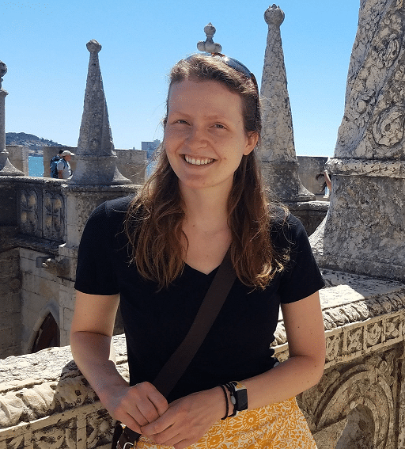

Welcome! I am PhD student in Harvard University's Department of Government. My work focuses on developing and implementing computational methods - including machine learning, natural language processing, geospatial analysis, and large-scale data management - for conflict and security applications. Current projects of interest are using natural language processing to generate insights into conflict causation, developing agent-based models of conflict intervention effectiveness, and building machine learning models of satellite imagery to generate additional information about conflict zones and actors. 
  
With a background in Classics (Ancient Greek and archaeology will always be near and dear to my heart!) and Statistics from Kenyon College, I worked in data consulting for three years at Keyrus USA before leaving for graduate study to discover new ways to apply data and computation for foreign policy and international conflict pursuits. I completed my Master's in Computational Analysis and Public Policy at the University of Chicago's Harris School of Public Policy in June 2022 with a certificate in Global Conflict Studies. 
    
I am continuously excited by the amount there is left to learn and experience - I love exploring what I haven't had the chance to: topics, places, cultures, food.. - and I hope to never stop growing through new experiences.   
  
## Current Role

PhD student at Harvard University Department of Government; Methods and International Relations subfields 

## Recognition

- Siebel Scholar, Class of 2022

