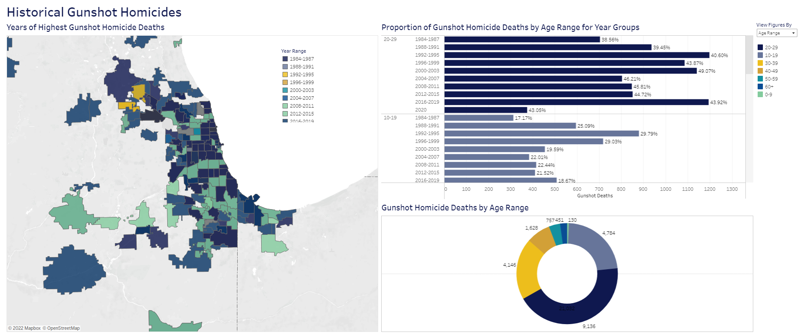
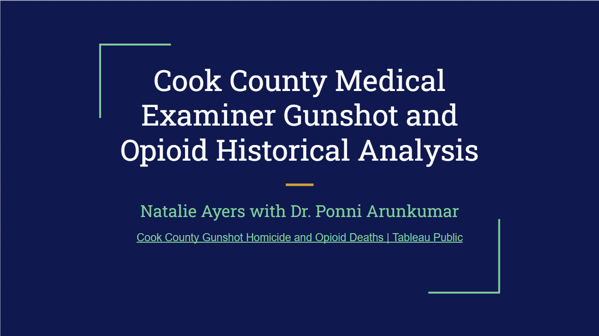

## Large-Scale Agent-Based Model of Israeli Counterterrorism  
  
An agent-based model developed with Mesa in Python which models Palestinian sentiment, terrorist attacks, and Israeli counterterrorism actions. This model is inspired by the 2012 paper "Moving Beyond Deterrence: The Effectiveness of Raising the Expected Utility of Abstaining from Terrorism in Israel", by Laura Dugan and Erica Chenoweth, which examined the effect of different Israeli actions on terrorist attacks using logistic regression. I utilize two kinds of agents, Palestinians and the Israeli government, and explore the impact of Israeli actions and Palestinian satisfaction on the number of attacks. To test parameter selection with more than 11,000 possible configurations, I scaled the modeling using both MPI and AWS Lambda functions. Future directions for this project include increasing the complexity of the model to include Israeli terrorist attacks and add nuance to the Palestinian actors and creating Mesa extensions which use Dask and Dask-CUDA to improve the ability of Mesa models to parallelize.   
  
  [Github Repo](https://github.com/natalie-ayers/large_scale_agent_based_counterterrorism)  
 

  

  
    
    
## Cook County Gunshot Homicide and Opioid Deaths  
  
 A Tableau dashboard and presentation gunshot homicides and opioid deaths in context of Chicago demographic, budget, geographic, leadership, and crime data. Developed while interning for the Cook County Medical Examiner, Dr. Ponni Arunkumar, in 2021.   

  
[Presentation](https://docs.google.com/presentation/d/15MvU1IsGYTSDqNEzOoKX-G8zy4eZfAKL26h_HxnBu44/edit?usp=sharing)   

